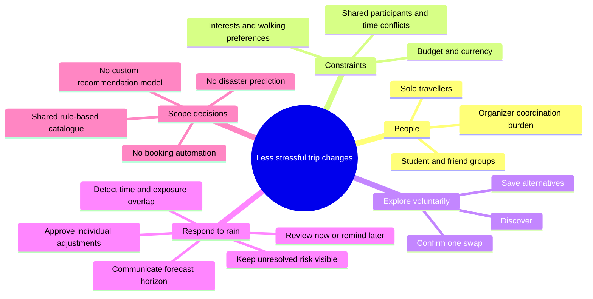
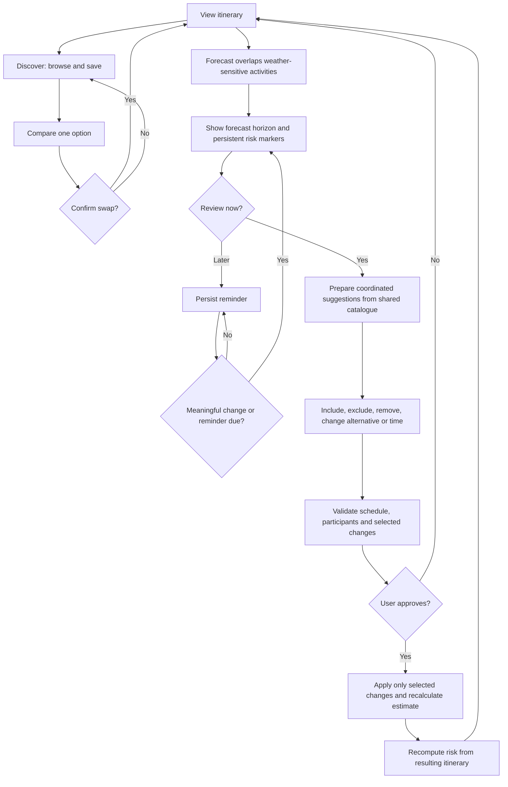

# Wanderly by [Team name]

**Team:** [Add actual members]  
**Problem statement:** Travel Planner  
**Video presentation:** [Add unlisted YouTube link]  
**Presentation slides:** [Add public link]  
**UI prototype:** [Add public deployment link and check it in incognito]

This is a submission draft. Replace the placeholders and add your team's actual ideation and mentor evidence before submitting.

## 1. Project overview

### The problem

Our initial target is small groups of independent travellers with different preferences and budgets, such as working adults planning a trip with friends. Their organizer has to reconcile different interests, walking preferences and spending limits. When an outdoor activity becomes unsuitable, replacing it also affects time slots, other travellers and costs. Solo travellers face the same scheduling decisions with fewer coordination steps.

Existing products already address significant parts of this problem. [Wanderlog](https://wanderlog.com/) offers collaborative itinerary planning and budgeting. [TripIt](https://help.tripit.com/en/support/solutions/articles/103000063296-flight-alerts) offers flight alerts, with [alternate-flight functionality](https://help.tripit.com/en/support/solutions/articles/103000063402-alternate-flights). We should not claim that collaboration, recommendations or disruption alerts are new by themselves. Our proposed differentiation is a focused review interaction that combines forecast timing, group suitability and approval of individual changes. Validate whether this interaction helps users through testing; it is not a claim that competitors cannot do it.

### Our solution

**Recommendations when you want them. Alternatives when you need them.**

Wanderly brings preferences, itinerary and estimated budgets together. Discover lets a traveller browse, save or manually swap one activity. When a forecast overlaps weather-sensitive activities, Adapt prepares several suggestions using the same alternatives catalogue. The traveller decides both when to review and which changes to apply; rejected changes retain their risk markers.

Working prototype interactions:

- Trip setup, individual/group preferences and participant assignment, including parallel activities.
- Editable itinerary, activity locks, transport and accommodation records.
- Estimated budgets, currency conversion using sample rates and recorded expenses.
- Discover, saved alternatives and a confirmed single-activity swap.
- Simulated weather risk by city, day, time overlap and activity exposure.
- Forecast timing bands, persistent in-app reminders and meaningful-change detection.
- Adaptive review with independent inclusion, removal, alternative choice and time editing.
- Selected changes update the itinerary and budget; unresolved risk remains visible.
- Phone presentation on desktop and responsive layout on narrow screens.

**Current boundary:** this is a local-browser prototype with illustrative catalogue entries, prices, imagery and weather. There is no connected booking, live weather, disaster prediction, live transport monitoring or multi-device group-sync service. A replacement changes the plan, not a reservation. Brief estimate labels stay near decisions; fuller context lives in About this prototype.

## 2. Ideation and process

### 2.1 Ideas considered

- **Keep: manual Discover and Saved.** Useful during ordinary planning, independently of disruptions.
- **Keep: contextual adaptive review.** Addresses changing circumstances without creating a second browse list.
- **Keep: partial approval and residual risk.** The user can reject one suggestion without losing awareness of the unresolved activity.
- **Keep: act now or later.** Early forecasts should support preparation without pressing users to change plans immediately.
- **Drop: permanent duplicate Plan B feed.** It repeated Discover and obscured the distinction between exploration and disruption response.
- **Drop: disaster prediction.** Reliable prediction and safety assessment are outside this project's resources and purpose. This prototype demonstrates rain affecting activities.
- **Drop: personalized video feed and scripted AI chat.** Neither is necessary to prove the planning interaction. They introduce content relevance, API and credibility work without validating the core outcome.
- **Defer: automatic flight/rail feeds and booking changes.** A later iteration could accept a user-reported delay and reuse the review pattern. Transport coverage and commercial integrations require separate validation.
- **Defer: multilingual UI.** First validate the end-to-end English flow. A complete English/Bahasa Melayu localization can follow if target-user testing supports it; a partial translation would increase design and QA work.

### 2.2 Ideation boards and evolution

These diagrams reconstruct the product decisions expressed in the project discussion. They are not evidence of an earlier team workshop; add original sketches or boards if available.



The central problem connects user constraints to both voluntary discovery and disruption response. The scope branch records directions intentionally excluded.



The flow makes both kinds of user control visible: whether to change an activity and when to respond. Risk is recalculated from the result rather than cleared for the whole trip.

Documented refinements from the discussion:

1. **Broad planner → mobile presentation:** improved the phone layout and expense-row alignment to make the prototype readable in a demo.
2. **Recommendation feed + Plan B → clearer roles:** retained voluntary discovery while removing the repeated permanent Plan B list.
3. **Broad disruption ambition → bounded weather scenario:** removed prediction claims and unnecessary video/AI surfaces; reused transparent preference rules.
4. **One-off replacement → coordinated, selective review:** added forecast timing, reminders and partial approval with persistent unresolved risk.

### 2.3 Mentor consultation

No mentor feedback was supplied for this draft. Add the actual date, mentor, specific feedback, decision and resulting change here. Do not present assistant suggestions or this reconstructed process as mentor consultation.

## 3. Design and prototype

Retains Wanderly's typography, colours, itinerary cards, shared modals and navigation. Controls wrap on narrow screens, modal content scrolls independently, action footers remain accessible, and warnings are contextual. Locked activities are excluded until explicitly unlocked.

Suggested 6-screen capture sequence:

1. Trip overview and estimated group budget.
2. Group preferences and activity participants.
3. Discover with a saved alternative and single-swap comparison.
4. Early forecast with review/wait actions.
5. Adaptive review with editable individual proposals.
6. Two changes applied with one original activity still marked at risk.

### Repeatable demo

Open **Explore an example trip** on the welcome page. Malaysia City Escape uses Kuala Lumpur and George Town; Japan Adventure uses Tokyo, Kyoto and Osaka. Start planning is the custom-trip route, where users enter their own destinations without a demo route preset. Example data is illustrative and opening an example replaces the current browser trip.

For the three-activity review demonstration, open the Japan example, then **Itinerary → Simulate weather → Rain · in 14 days**. Save a reminder and advance to **Rain · tomorrow**. Review suggestions. The first activity is locked; leave it excluded or explicitly unlock it. Remove a suggestion and use **Undo removal** to restore that exact proposal without resetting other edits. Apply two changes and check the remaining risk indicator. Clear the forecast to remove its risk markers without undoing approved changes.

The simulation also supports 4-day and 8-day horizons and heavier rain. Labels describe forecast timing: near-term, developing, early and very early. They are not measured confidence or accuracy scores. A production implementation should consume a weather provider's forecast and explain its supplied uncertainty rather than invent AI accuracy percentages. Longer-range local detail is more uncertain; see the [Met Office explanation](https://weather.metoffice.gov.uk/guides/about-forecasts).

### Optional features and rubric scope

App-language localization does not conflict with the supplied rubric. A bounded English/Bahasa Melayu interface using reviewed translation dictionaries is feasible; include labels, validation, plural forms and layout testing. It is deferred in this version, not promised as complete. It does not require translating user-entered trip content automatically.

A small optional helpful/not-helpful question after reviewing an adjustment is feasible as a later usability improvement. Store only the user's actual answer and let them change it. Do not invent satisfaction percentages, imply a study has occurred, or claim automatic machine learning from a handful of votes. The current version prioritizes the core planning flow and does not implement satisfaction collection.


## 4. What makes it different

- **One alternatives catalogue, two purposes:** exploratory recommendations and contextual multi-activity adjustment reuse the same underlying data.
- **Control over timing:** far-away forecasts offer a quieter review-or-wait choice; near-term forecasts emphasize review.
- **Partial resolution is explicit:** accepting two changes does not silently dismiss risk on a third.
- **Group-aware validation:** respect locks, walking preferences, shared-participant conflicts, destination days and arrival buffers; show estimated cost impact before approval.

The recommendation concept resembles a content feed only at the interaction level: ranked choices that users can save. It does not need YouTube videos, behavioural tracking or a custom machine-learning model. The novelty pitch is the combined decision flow, not claiming a new recommendation algorithm.

## 5. Technical architecture and feasibility

### Implemented stack

React, TypeScript, Vite and Tailwind CSS provide the interface. React context and localStorage hold the example trip, saved alternatives and reminder state. Pure TypeScript functions rank the shared catalogue and derive weather risk. No additional runtime service or model is needed for the prototype.

The catalogue currently includes illustrative concepts rather than verified places. Activity costs are estimates and replacement transport estimates are retained. The scheduling check detects participant overlaps and destination/arrival constraints; it is not a route optimizer or venue-availability engine. Forecast horizon bands are UX heuristics, not measured probabilities.

### Proposed three-week build scope

**Week 1 — shared planning:** persist trips, members, preferences and edits in Supabase Auth/Postgres. Restrict reads and writes to trip members with row-level security. Add version checks to avoid overwriting another member's edits. Validate the core flow with a small student/friend group.

**Week 2 — one bounded adaptive scenario:** curate a small catalogue for one destination with explicit exposure, duration and opening-hours metadata. Reuse the current ranking/review logic. Connect one weather adapter only if provider coverage, horizon, terms and quota fit; retain an explicitly labelled simulated scenario when data is unavailable. Show source and update time. Group edits should propagate through subscriptions or refresh, with a fresh review required after conflicting changes.

**Week 3 — quality and submission:** test solo and group paths, partial approval, reminder persistence, stale data, offline/API failure, budget calculations and narrow-screen accessibility. Deploy the web app, verify the public link in incognito, record the core flow, and finish actual mentor/iteration evidence.

Frontend hosting can use a standard static deployment such as Vercel; a server function can proxy the weather service and keep API keys off the client. This hosting and backend are proposed, not already connected. See [Supabase row-level security](https://supabase.com/docs/guides/database/postgres/row-level-security) and [database change subscriptions](https://supabase.com/docs/guides/realtime/subscribing-to-database-changes) for the relevant implementation patterns.

Resource assumptions: a laptop, the team's existing web-development skills and a small curated test dataset. No GPU or custom model training. Recheck provider limits before choosing a plan, cap API usage, cache responses and keep manual editing functional when a service fails. If time becomes constrained, prioritize shared preferences and the approval flow over adding integrations.

Out of the three-week scope: payments, automatic rebooking, disaster prediction, global transport monitoring, a personalized video feed and comprehensive multilingual content.

### Validation commands

```sh
node node_modules/typescript/bin/tsc --noEmit
node scripts/test-discovery.cjs
npm run build
```

Tests cover discovery, saved items, budget conversion, solo participation, partial application, locks, stale/cleared forecasts, horizon bands, reminders, time boundaries and rescheduling. Browser checks cover early/reminded/near-term states, editing proposals, partial approval, cleared risk, manual swap and phone layout.

## Presentation outline — 4:30 target

- **0:00–0:35:** introduce the student-group coordination problem and the product promise.
- **0:35–1:20:** show preferences, itinerary and estimated budget; briefly demonstrate Discover/Saved.
- **1:20–2:55:** simulate an early forecast, defer it, advance to near-term, edit proposals and apply two while leaving one unresolved.
- **2:55–3:45:** explain the shared rule-based catalogue, local prototype boundary and three-week implementation scope.
- **3:45–4:30:** explain the expected impact and show the resulting itinerary. Present reduced replanning effort as a hypothesis to measure, not an invented user-study result.

Keep ideation and mentor evidence in this README. Add actual public slides and an unlisted video link above before submitting.
